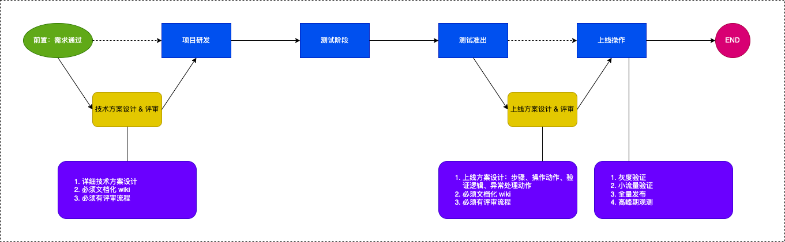
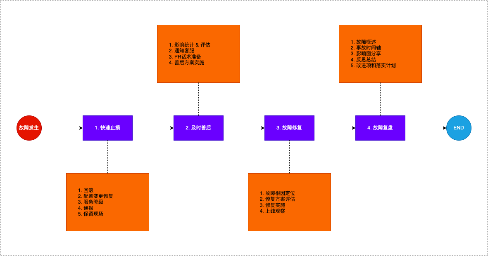

## 稳定性建设

### 一、事前治理

> 识别风险、降低风险

#### 1.1 流程建设

重点说明

-   1. 技术方案设计 & 评审：考虑比安娜姐条件&异常逻辑；监控设计；确认是否需要设计上线方案
-   2. 代码强制 CR：对分支进行强制 CR 配置
-   3. 上线方案：发布流程、操作指令、验证逻辑、异常处理
-   4. 高峰期观测：上线代码必须进行高峰期观察

#### 1.2 意识建设

##### 线上变更五条军规

-   提前通报要记得
    -   强调 `评估影响范围`，提前通报到相关团队
-   变更步骤要完备
    -   服务上线必须经过审批，任何线上变更都要 `事先准备回滚方案`
-   分级发布要遵守
    -   所有变更都要经过 `灰度 -> 少量 -> 全量` 流程
-   高峰窗口要避免
    -   `业务高峰期严禁进行服务上线`
-   服务检查要执行
    -   变更前明确检查点；变更中要检查，`发现异常立刻回滚`；变更后验收，`发现异常立刻回滚`；
    -   变更和故障时间重合，立刻回滚，在判断是否关联
    -   关键系统、组件变更 `double check` 后方可进一步扩大变更范围

### 二、事中、事后处置

> 提升效率、降低影响、总结反思、优化改进

原则：先通报后处理原则，先恢复后解决原则

-   故障发生后，`5Min` 内在 Core 群进行通报 - 简洁、说明影响
-   故障处理完成后，`24H` Core 群补全通报内容
-   故障处理完成后及时完成定级
-   故障处理完成后 `7Day` 完成复盘
-   复盘内容必须要包含：
    -   事故的发现方式，是否主动发现
    -   发现时间
    -   辅助监控能力完善，举一反三
